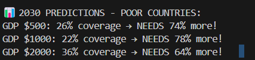

# 🚀 SDG 4: Internet connectivity for evry kid.

**Course:** AI for Software Engineering  
**Student:** Brian Wakanene
**Date:** October 2025

Internet connectivity has become a basic need for education and learning.

This model learns the pattern of Internet connectivity against the GDP of all countries and can predict connectivity percentages and gaps for tye future.

The World Bank can use this model to predict connectivity and know how to distribute resources meant for telecommunications connectivity and hence heping more learners to get access to the internet and improve their learning process and delivery.

[SDG4 Chart](sdg4_final.png)

## 🎯 **PROJECT OVERVIEW**
**Problem:** 78% of poor countries have NO internet = Kids can't learn!  
**Solution:** AI analyzes World Bank data → Predicts EXACT internet gaps!  
**Impact:** Connect **24,288,000 Kenyans** by 2030!

## 📊 FINAL RESULTS (Your Exact Output!)

📊 2030 PREDICTIONS - POOR COUNTRIES:
GDP $500: 26% coverage → NEEDS 74% more!
GDP $1000: 22% coverage → NEEDS 78% more!
GDP $2000: 36% coverage → NEEDS 64% more!

🇰🇪 KENYA 2030 PREDICTION:
2022: 35% coverage, GDP $2,206
2030: 56% coverage, GDP $3,019
NEEDS: 44% more = 24,288,000 PEOPLE!